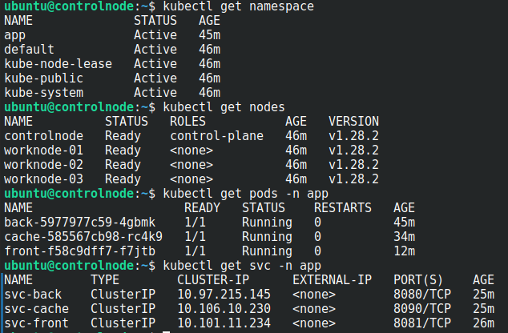
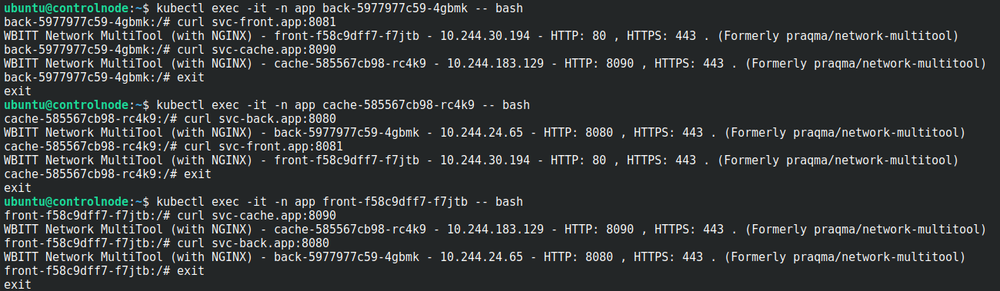
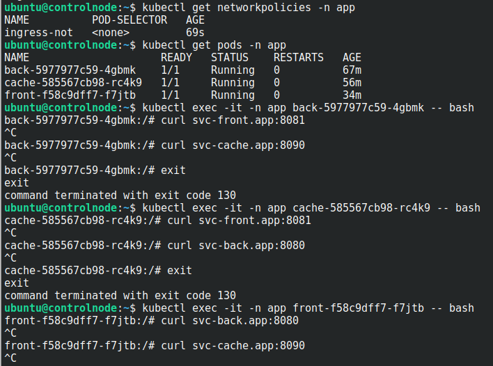
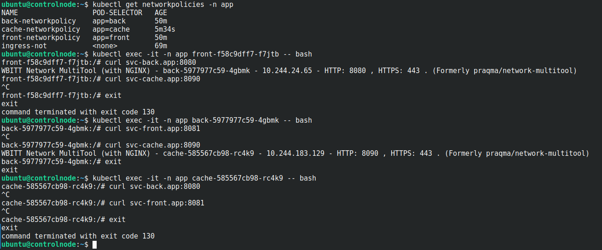

# Домашнее задание к занятию «Как работает сеть в K8s»

### Цель задания

Настроить сетевую политику доступа к подам.

### Чеклист готовности к домашнему заданию

1. Кластер K8s с установленным сетевым плагином Calico.

### Инструменты и дополнительные материалы, которые пригодятся для выполнения задания

1. [Документация Calico](https://www.tigera.io/project-calico/).
2. [Network Policy](https://kubernetes.io/docs/concepts/services-networking/network-policies/).
3. [About Network Policy](https://docs.projectcalico.org/about/about-network-policy).

-----

### Задание 1. Создать сетевую политику или несколько политик для обеспечения доступа

1. Создать deployment'ы приложений [frontend](./playbook/deployment/deployment_front.yaml), [backend](./playbook/deployment/deployment_back.yaml) и [cache](./playbook/deployment/deployment_cache.yaml) и соответсвующие сервисы.
2. В качестве образа использовать network-multitool.
3. Разместить поды в [namespace App](./playbook/site.yml?plain=1#L221).

```
The Namespace "App" is invalid: metadata.name: Invalid value: "App": a lowercase RFC 1123 
label must consist of lower case alphanumeric characters or '-', and must start and end 
with an alphanumeric character (e.g. 'my-name',  or '123-abc', regex used for validation 
is '[a-z0-9]([-a-z0-9]*[a-z0-9])?')
```


4. Создать [политики](./playbook/ingress/), чтобы обеспечить доступ [frontend](./playbook/ingress/ingress-front.yaml) -> [backend](./playbook/ingress/ingress-back.yaml) -> [cache](./playbook/ingress/ingress-cache.yaml). Другие виды подключений [должны быть запрещены](./playbook/ingress/ingress-not.yaml).
5. Продемонстрировать, что трафик разрешён и запрещён.

Проверка доступа ресурсов



Запрещаем доступ полностью.



Применяем frontend -> backend -> cache



### Правила приёма работы

1. Домашняя работа оформляется в своём Git-репозитории в файле README.md. Выполненное домашнее задание пришлите ссылкой на .md-файл в вашем репозитории.
2. Файл README.md должен содержать скриншоты вывода необходимых команд, а также скриншоты результатов.
3. Репозиторий должен содержать тексты манифестов или ссылки на них в файле README.md.
