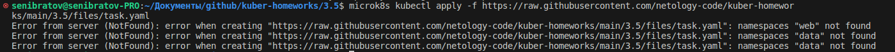
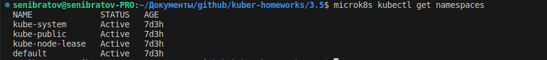
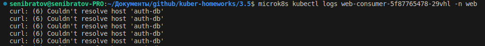
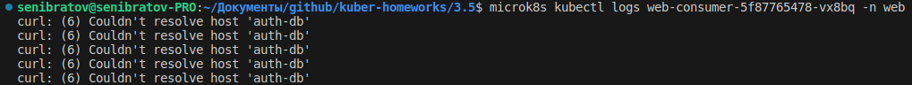
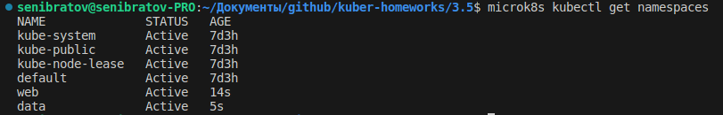
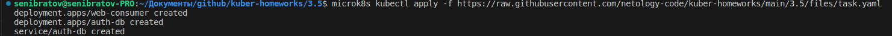
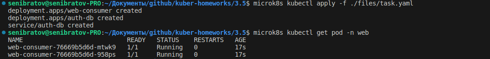
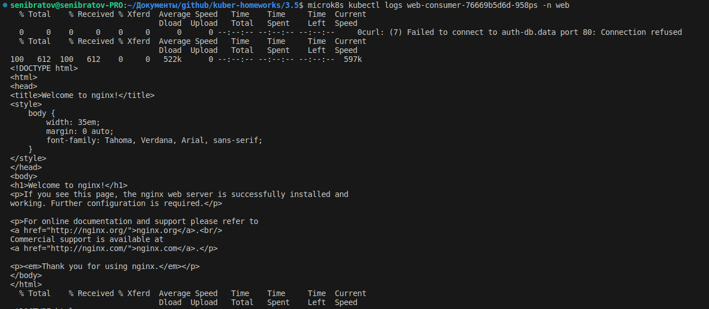
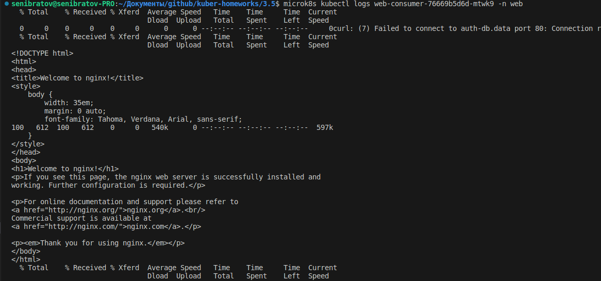

# Домашнее задание к занятию Troubleshooting

### Цель задания

Устранить неисправности при деплое приложения.

### Чеклист готовности к домашнему заданию

1. Кластер K8s.

### Задание. При деплое приложение web-consumer не может подключиться к auth-db. Необходимо это исправить

1. Установить приложение по команде:
```shell
kubectl apply -f https://raw.githubusercontent.com/netology-code/kuber-homeworks/main/3.5/files/task.yaml
```
2. Выявить проблему и описать.

2.1 Нет указанных в deploy namespaces





2.2 Logs





Не удалост определить местонахождение хоста 'auth-db'. 

3. Исправить проблему, описать, что сделано.
3.1 Добавил namespaces
3.1.1



Приложение "поднялось".



3.1.2 Прописал [namespace](./files/task.yaml?plain=1#L1)

3.2 Поды находятся в разных namespace. Два варианта решения. 
- определить IP и прописать в deploy(противоречит логике K8s)
- [прописать namespace в deploy](./files/task.yaml?plain=1#L20)

4. Продемонстрировать, что проблема решена.



Логи pod





### Правила приёма работы

1. Домашняя работа оформляется в своём Git-репозитории в файле README.md. Выполненное домашнее задание пришлите ссылкой на .md-файл в вашем репозитории.
2. Файл README.md должен содержать скриншоты вывода необходимых команд, а также скриншоты результатов.
3. Репозиторий должен содержать тексты манифестов или ссылки на них в файле README.md.
